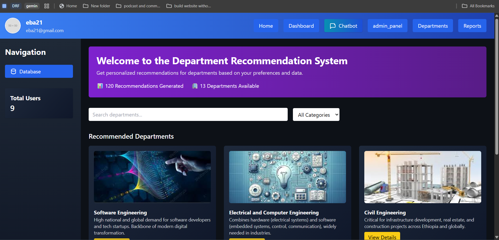

# Department System

A web-based Department System for managing users, teams, reports, and AI-powered chatbots. Built with PHP (backend), HTML/CSS/JS (frontend), and integrated with AI APIs for enhanced user experience.



---

## Table of Contents

- [Features](#features)
- [Project Structure](#project-structure)
- [Setup-and-Installation](#setup-and-installation)
- [Usage](#usage)
- [API-Integration](#api-integration)
- [Contributing](#contributing)
- [Team](#team)
- [License](#license)

---

## Features

- User registration and authentication (Admin/User roles)
- Authentication using third-party integration (OAuth: Google Login)
- Team management (create, delete, list teams and members)
- Department and report management
- AI-powered chatbot (Google Gemini, GPT-2 via HuggingFace)
- File uploads (profile images, reports)
- RESTful API endpoints
- Responsive frontend with Tailwind CSS
- Admin dashboard and user dashboard
- Secure session management and validation
- Uses PDO for database access
- Supports remote/cloud database storage (Supabase)

---

## Authentication Using Third-Party Integration (OAuth)

This project supports authentication via third-party providers using OAuth 2.0. Users can log in with their Google accounts for a seamless and secure authentication experience.

- **Google OAuth Integration:**
  - Users can sign in using their Google account.
  - OAuth flow is handled in the backend (`backend/controllers/google_login.php`, `backend/controllers/google_callback.php`).
  - After successful authentication, users are redirected to the dashboard.
  - Secure session management is implemented for OAuth users.

**To enable Google OAuth:**

1. Create a project in the [Google Cloud Console](https://console.developers.google.com/).
2. Set up OAuth 2.0 credentials and add your redirect URI.
3. Update your client ID and secret in the backend configuration files.
4. Use the login with Google button on the login page.

---

## Project Structure

```
backend/
  ├── Admin/                # Admin-specific PHP scripts
  ├── Admin_models/         # Admin model logic
  ├── api/                  # API endpoints (AI, chatbot, etc.)
  ├── config/               # Configuration files (DB, app config)
  ├── controllers/          # Main controllers (user, team, report, etc.)
  ├── helpers/              # Helper utilities (validation, serialization)
  ├── middlewares/          # Middleware (auth, CORS)
  ├── models/               # Data models
  ├── public/               # Publicly accessible files (index.php)
  ├── uploads/              # Uploaded files (images, reports)
  └── vendor/               # Composer dependencies

frontend/
  ├── admin/                # Admin dashboard pages
  ├── css/                  # Stylesheets
  ├── image/                # Frontend images
  ├── js/                   # JavaScript files
  ├── about.php
  ├── admin.php
  ├── Authorization.php
  ├── chatbot.php
  ├── contact.php
  ├── dashbord.php
  ├── department.php
  ├── index.php
  ├── login.php
  ├── main.js
  ├── report.php
  ├── signup.php
  └── userdashbord.php

README.md
```

---

## Setup-and-Installation

1. **Clone the repository:**

   ```sh
   git clone https://github.com/ebu0g/Ip2-project.git
   cd Ip2-project
   ```
2. **Backend Setup:**

   - Install PHP (>=7.4) and Composer.
   - Run `composer install` in the `backend/` directory.
   - Configure your database in `backend/config/database.php`.
   - Set up your `.env` files as needed.
3. **Frontend Setup:**

   - Open `frontend/index.php` in your browser or set up a local server (e.g., XAMPP, WAMP, or PHP built-in server).
4. **API Keys:**

   - For AI features, set your API keys in `backend/api/openapi.php` and `backend/api/google-gemini.php`.

---

## Usage

- **User Registration:** Visit `/frontend/signup.php` to create a new account.
- **Login:** Access `/frontend/login.php`.
- **Admin Dashboard:** `/frontend/admin.php` (admin only).
- **User Dashboard:** `/frontend/userdashbord.php`.
- **Chatbot:** `/frontend/chatbot.php` for AI-powered chat.
- **Team & Report Management:** Use the dashboard interfaces.

---

## API-Integration

- **Google Gemini:**
  Integrated for chatbot and AI features.
  Configure API keys in the respective backend files.

---

## Contributing

1. Fork the repository.
2. Create a new branch (`git checkout -b feature/YourFeature`).
3. Commit your changes (`git commit -am 'Add new feature'`).
4. Push to the branch (`git push origin feature/YourFeature`).
5. Open a Pull Request.

---

## Team

| Name          | ID No.     |
| ------------- | ---------- |
| Eba Tesfa     | ETS0401/15 |
| Ebawak Gebisa | ETS0402/15 |
| Eyob Ketemaw  | ETS0495/15 |
| Fiker Michael | ETS0548/15 |
| Henok Dagne   | ETS0672/15 |

---

## License

This project is for educational purposes. See [LICENSE](LICENSE) if available.

---

## Database

This project uses PHP PDO for secure and flexible database access. You can use a local database or connect to a remote/cloud database service such as Supabase for storing all application data.

- **PDO Integration:**

  - All database operations use PHP's PDO extension for security and portability.
  - Database configuration is managed in `backend/config/database.php`.
- **Remote/Cloud Database (Supabase):**

  - You can use [Supabase](https://supabase.com/) as a managed PostgreSQL database backend.
  - Update your database connection settings in the configuration file to point to your Supabase instance.
  - Store credentials securely in your `.env` file.

**Example `.env` settings for Supabase:**

```env
DB_HOST=your-supabase-host.supabase.co
DB_PORT=5432
DB_DATABASE=your_db_name
DB_USERNAME=your_db_user
DB_PASSWORD=your_db_password
```

**Note:**

- Make sure your Supabase instance allows connections from your server's IP address.
- For local development, you can use a local PostgreSQL or MySQL database as well.
